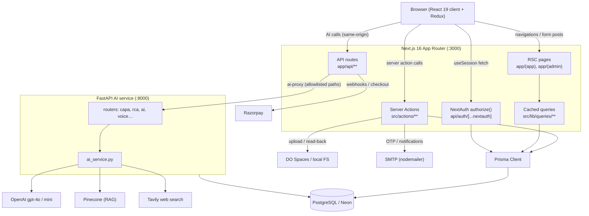
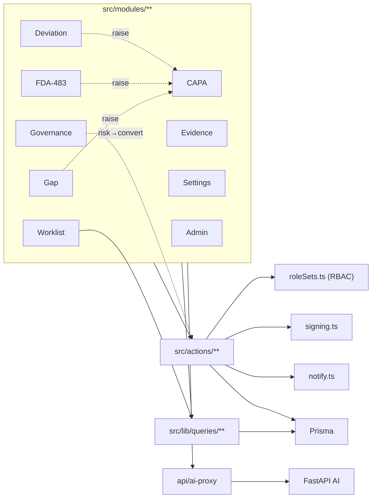
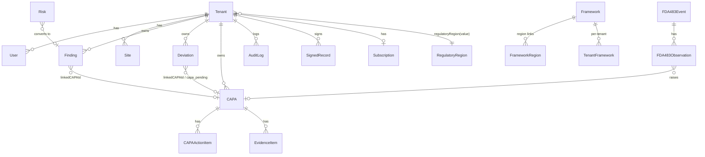
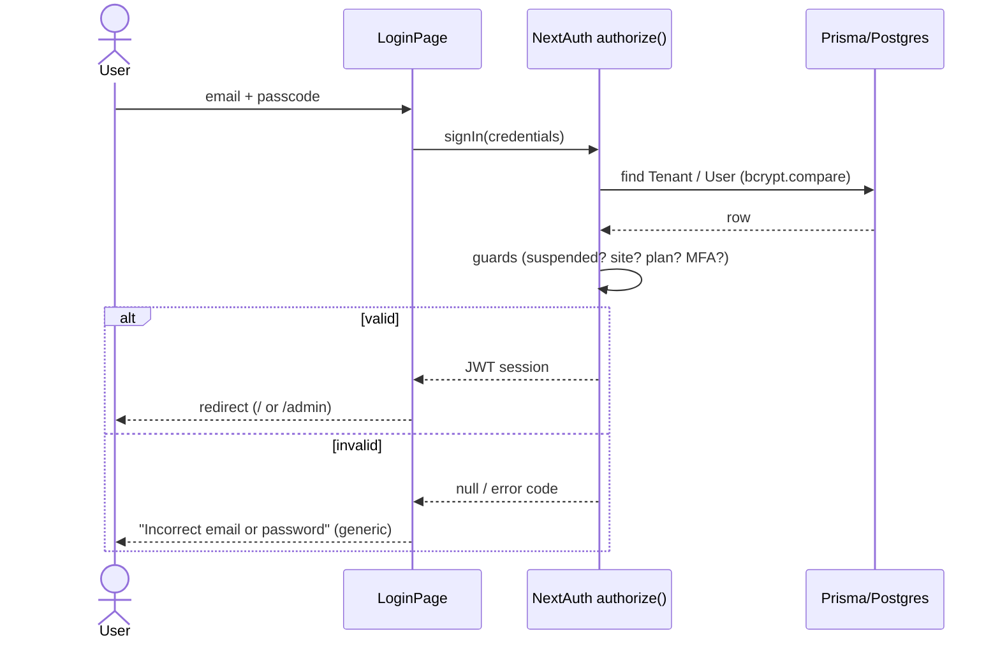
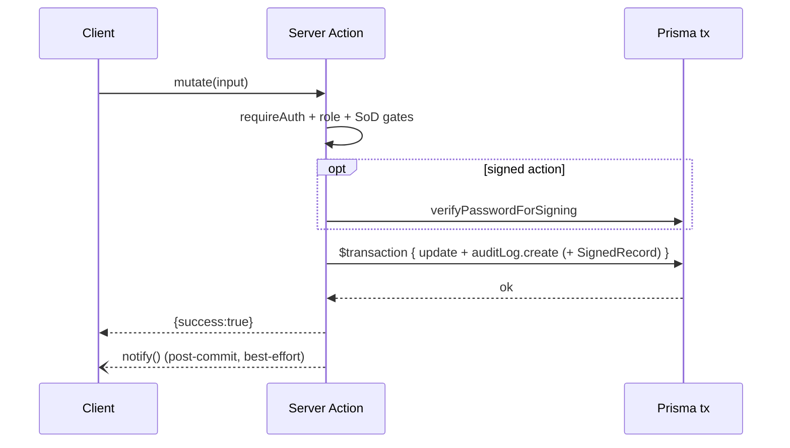
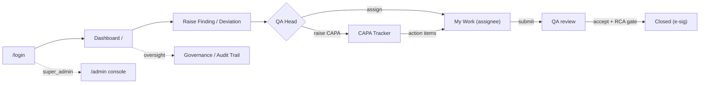

# Pharma Glimmora — Project Documentation

> Generated from a direct read of the codebase. Where the code is ambiguous or a
> behaviour could not be confirmed, it is marked **[unclear]** rather than guessed.
> The repository was inspected while paused mid-rebase on origin's `538c24c`, so
> this reflects mainline code; a few in-flight local changes are called out in
> **§7 Notes & Gaps**.

---

## 1. Project Overview

**What it does.** Pharma Glimmora is a multi-tenant **Quality Management System (QMS) for pharmaceutical / GxP compliance**. Each customer organisation ("tenant") manages the regulated quality lifecycle in one place: recording compliance gaps (Findings), reporting and investigating Deviations, running Corrective & Preventive Actions (CAPAs), handling FDA-483 inspection observations and responses, computer-system validation (CSV/CSA), a risk register and management reviews (Governance), inspection-readiness training, and an evidence/document library. Sensitive actions (closures, approvals, inspection responses) are captured as **21 CFR Part 11 electronic signatures**, and every mutation writes to an **append-only audit trail** with ALCOA+ separation-of-duties controls. A separate AI service provides regulatory Q&A, RAG over reference documents, and drafting help.

**Project type.** A **server-rendered web application** (Next.js App Router) with **in-process server actions + a thin API layer**, plus a **separate FastAPI AI microservice**. Not a CLI or mobile app.

**Tech stack**

| Layer | Technology |
|---|---|
| Language | TypeScript 5.9 (frontend), Python 3.x (AI backend) |
| Web framework | Next.js 16 (App Router, Turbopack in dev), React 19 |
| Styling | Tailwind CSS v4, lucide-react icons, framer-motion |
| State (client) | Redux Toolkit + react-redux; TanStack Query present |
| Forms/validation | react-hook-form + Zod 4 |
| Auth | NextAuth v4 (Credentials provider), bcryptjs |
| ORM / DB | Prisma 6 → **PostgreSQL** (Neon, shared with the AI backend) |
| Payments | Razorpay |
| File storage | AWS S3 SDK → DigitalOcean Spaces, or local disk (`FILE_STORAGE_BACKEND`) |
| Email | nodemailer (SMTP / Gmail app-password) |
| AI backend | FastAPI, uvicorn, SQLAlchemy 2 + psycopg2, **OpenAI** (`gpt-4o` / `gpt-4o-mini`), **Pinecone** (RAG), Tavily (web-search grounding), PyJWT, pypdf/python-docx |
| Charts | recharts |
| Testing | Playwright (e2e); `node:test` unit tests via tsx |
| Hosting | **[unclear]** — env/CORS defaults and comments suggest DigitalOcean App Platform (frontend + FastAPI) with Neon Postgres; not pinned in a deploy manifest in-repo |

**Setup & run**

```bash
# 1. Install
npm install
cd backend && python -m venv .venv && .venv/Scripts/pip install -r requirements.txt   # (Scripts on Windows, bin on *nix)

# 2. Configure env (see below), then set up the DB
npx prisma generate
npx prisma migrate dev          # or: npm run db:migrate
npm run db:seed                 # seeds regions, frameworks, demo data

# 3. Run both web + AI API together
npm run dev                     # next dev (:3000) + uvicorn (:8000) via concurrently
#   or individually:
npm run dev:web                 # Next.js only, :3000
npm run dev:api                 # FastAPI only, :8000  (scripts/dev-api.mjs → backend/.venv uvicorn app.main:app)

# Build / start (production)
npm run build && npm run start
```

**Environment variables** (frontend `.env`; names only)

- **Required:** `DATABASE_URL` (**must be `postgresql://…`** — the schema provider is postgresql), `NEXTAUTH_URL`, `NEXTAUTH_SECRET` (≥32 chars).
- **Payments:** `RAZORPAY_KEY_ID`, `RAZORPAY_KEY_SECRET`, `RAZORPAY_WEBHOOK_SECRET`, `NEXT_PUBLIC_RAZORPAY_KEY_ID` (publishable).
- **AI proxy / URLs:** `BACKEND_URL` (or `NEXT_PUBLIC_API_URL`), `NEXT_PUBLIC_AI_API_URL`, `NEXT_PUBLIC_SITE_URL`, `NEXT_PUBLIC_APP_VERSION`.
- **Files:** `FILE_STORAGE_BACKEND`, `DO_SPACES_KEY/SECRET/BUCKET/REGION/ENDPOINT`, `EVIDENCE_MAX_FILE_MB`, `STAGE_DOC_MAX_FILE_MB`.
- **Email:** `GMAIL_USER`, `GMAIL_APP_PASSWORD`.
- **AI backend (`backend/.env`):** `OPENAI_API_KEY`, `DATABASE_URL`, `ALLOWED_ORIGINS`, plus Pinecone/Tavily keys.

> ⚠️ **Known setup pitfall (see §7):** `.env.example` ships `DATABASE_URL="file:…"` (SQLite) while the schema is postgresql; a `file:` URL makes every DB-touching route (including NextAuth) throw and return HTML → the classic `CLIENT_FETCH_ERROR: Unexpected token '<'`.

---

## 2. Architecture

### Folder responsibilities

| Path | Responsibility |
|---|---|
| `app/` | Next.js App Router. Route groups: `(app)` (tenant workspace), `(admin)` (platform Super-Admin console), `(public)` (signup), plus `login/`, `site-picker/`, `docs/`, and `api/`. |
| `app/api/` | Thin route handlers: `auth` (NextAuth), `ai-proxy` (→ FastAPI), `documents`/`evidence`/`findings`/`stage-documents` (authenticated file read-back), `signup`, `subscriptions`, `webhooks` (Razorpay). |
| `src/actions/` | **Server Actions** — every compliance mutation; each pairs with an `auditLog()` write and (where required) an e-signature. |
| `src/lib/queries/` | Cached, tenant-scoped Prisma read layer (React `cache()`-wrapped). |
| `src/lib/` | Cross-cutting: `auth.ts`, `prisma.ts`, `permissions/roleSets.ts` (RBAC single source of truth), `signing.ts`, `notify.ts`, `fileStorage.ts`, mappers, displayIds. |
| `src/modules/` | Feature UIs (one folder per module: gap-assessment, deviation, capa, fda-483, evidence, governance, readiness, worklist, settings, notifications, admin, csv-csa, support, regulatory-intelligence, dashboard, audit-trail, ai-capa, change-control). |
| `src/components/` | Shared UI primitives (tables, modals, layout shell, forms). |
| `src/store/` | Redux slices (`auth`, `settings`, `regions`, `permissions`). |
| `src/constants/`, `src/schemas/`, `src/types/`, `src/hooks/` | Shared constants (frameworks, regions, status taxonomy), Zod schemas, TS types, React hooks (`useTenantConfig`, `usePermissions`, …). |
| `prisma/` | `schema.prisma` (57 models), migrations, `seed.ts`. |
| `backend/` | FastAPI AI service (`app/main.py`, `routers/`, `ai_service.py`, `rag/`, `models/`, `database/`). |
| `scripts/` | Dev/util scripts (`dev-api.mjs` launches uvicorn; backfills; mailer test). |
| `docs/` | In-repo documentation (user + process manuals, audits). |
| `tests/`, `public/`, `uploads/` | e2e tests, static assets, local uploaded files. |

### Key entry points

- **Web app:** `app/layout.tsx` → route-group layouts `app/(app)/layout.tsx` (walls `super_admin` to `/admin`) and `app/(admin)/…`. Tenant home: `app/(app)/page.tsx` (Dashboard).
- **Auth:** `app/api/auth/[...nextauth]/route.ts` (`authorize()` is the credential authority) + `src/lib/auth.ts` (`requireAuth`, `resolveUserFk`).
- **AI:** `app/api/ai-proxy/[...path]/route.ts` → FastAPI `backend/app/main.py`.
- **Writes:** `src/actions/**`. **Reads:** `src/lib/queries/**`.
- **AI backend:** `backend/app/main.py` (`FastAPI()`, health at `/health`, routers mounted).

### External services / integrations

OpenAI (via FastAPI), Pinecone (RAG vectors), Tavily (web search), Razorpay (subscriptions/webhooks), DigitalOcean Spaces (S3-compatible file storage), SMTP/Gmail (email), Neon PostgreSQL (shared DB).

### Architecture diagram



---

## 3. Modules

Each tenant feature follows the same shape: **UI (`src/modules/<x>`) → Server Actions (`src/actions/<x>.ts`) → cached queries (`src/lib/queries/<x>.ts`) → Prisma**, with `roleSets.ts` gating and `auditLog()` on every write.

### Gap Assessment (Findings)
- **Location:** `src/modules/gap-assessment/`, `src/actions/findings.ts`, `src/lib/queries/findings.ts`, `src/lib/finding-close.ts`.
- **Responsibility:** Record and work compliance findings to a verified close; carries a framework key (e.g. `p11`).
- **Exposes:** `createFinding`, `updateFinding`, `assignFinding`, `saveFindingRCA`, `reviewFinding`/`reworkFinding`, `closeFinding`, `submitFinding`, `findingCloseBlockers()`.
- **Depends on:** roleSets, finding-close (RCA + SoD gate), frameworks constants. **Used by:** Dashboard, Worklist, Governance (risk→gap conversion).

### Deviations
- **Location:** `src/modules/deviation/`, `src/actions/deviations.ts`, `src/actions/deviation-tasks.ts`.
- **Responsibility:** Report → investigate → CAPA-decision → sign-close a deviation, with the strictest SoD in the app.
- **Exposes:** `createDeviation`, `startInvestigation`, `completeInvestigation`, `saveCAPADecision`, `closeDeviation` (signed), `rejectDeviation` (signed), `assignDeviationTask`, `reworkDeviationTask`.
- **Depends on:** signing, roleSets, CAPA (raise). **Used by:** Worklist (tasks), Governance (risk→deviation).

### CAPA
- **Location:** `src/modules/capa/`, `src/actions/capas.ts` (barrel over `src/actions/capas/{lifecycle,closure,alignment,rca-review,verification,action-items,effectiveness}.ts`), `src/lib/capa-readiness.ts`.
- **Responsibility:** Full corrective-action lifecycle: raise, RCA review, action items, evidence, submit-readiness gate, e-signed close, 90-day effectiveness.
- **Exposes:** `createCAPA`, `reviewRCA`, `addActionItem`/`updateActionItem`, `submitForReview`, `signAndCloseCAPA` (signed), `rejectCAPA`, `recordEffectivenessReview` (signed), `getCAPAReadiness()`.
- **Depends on:** capa-readiness, capa-approvals, roleSets. **Used by:** Deviations, FDA-483, Findings, Worklist (action items).

### FDA-483 / Inspections & Regulatory
- **Location:** `src/modules/fda-483/`, `src/actions/fda483.ts`, `src/lib/queries/fda483.ts`.
- **Responsibility:** Inspection events, observations, RCA, raise CAPA, draft + e-sign the response, record outcome.
- **Exposes:** `createFDA483Event`, `addObservation`, `raiseCAPAFromObservation`, `saveResponseDraft`, `signSubmitFDA483Response` (signed), `recordFDA483Outcome` (signed).

### Evidence & Documents
- **Location:** `src/modules/evidence/`, `src/actions/documents.ts` (library), `src/actions/evidence.ts` (CAPA 7-category evidence), `src/lib/queries/evidenceLibrary.ts`.
- **Responsibility:** Document library + CAPA evidence; authenticated read-back via `app/api/documents|evidence|findings/**`.
- **Exposes:** `createDocument`, `updateDocument`, `deleteDocument`, `addEvidenceFile`, `rejectEvidenceCategory`.

### Governance (Risk Register + Management Reviews)
- **Location:** `src/modules/governance/`, `src/actions/{risks,management-decisions,risk-conversion}.ts`.
- **Responsibility:** Risk register, management-review minutes, and converting a risk into a Gap/Deviation/CAPA. Non-GxP; **Customer Admin may author here** (the exception to view-only).
- **Exposes:** `createRisk`, `updateRisk`, `archiveRisk`, `convertRiskToGap|Deviation|Capa`, `createManagementDecision`.

### Training & Inspection Readiness
- **Location:** `src/modules/readiness/`, `src/actions/inspections.ts`.
- **Responsibility:** Prepare for an inspection (standard task set), practice simulations, readiness score.
- **Exposes:** `createInspection`, `markActionComplete`, `completeInspection`, `createSimulation`/`completeSimulation`.

### Worklist ("My Work")
- **Location:** `src/modules/worklist/`, `src/lib/queries/worklist.ts`, `src/actions/stage-tasks.ts`.
- **Responsibility:** One per-user list aggregating assigned CAPA action items, deviation tasks, CSV stage tasks, and gap findings.
- **Exposes:** `getWorklist()`; the panel calls the source modules' submit/upload actions.

### Regions & Frameworks (platform + tenant)
- **Location:** `src/actions/{regions,frameworks}.ts`, `src/lib/queries/{regions,frameworks}.ts`, `src/modules/admin/platform-regions/*`, `src/modules/admin/platform-frameworks/*`, tenant Frameworks tab.
- **Responsibility:** Central regulatory-region catalog + framework catalog; resolves which frameworks apply to a tenant.
- **Exposes:** `effectiveFrameworksForTenant()`, `setFrameworkPlatformEnabled`, `setTenantFrameworkEnabled`, `createRegion`, `archiveRegion` (auto-reassigns tenants to GLOBAL), `supersedeRegionValue`.

### Settings
- **Location:** `src/modules/settings/`, `src/actions/settings.ts`, `src/actions/roleLimits.ts`.
- **Responsibility:** Tenant admin — people, sites, frameworks, subscription view; GxP-signatory + password-gated user/site deletes.

### Admin console
- **Location:** `src/modules/admin/*`, `app/(admin)/admin/*`, `src/actions/tenants.ts`.
- **Responsibility:** Super-Admin platform ops — customer accounts, regions/frameworks, platform audit, plans.
- **Exposes:** `createTenant`, `updateTenant`, plan actions.

### Notifications
- **Location:** `src/modules/notifications/`, `src/actions/notifications.ts`, `src/lib/notify.ts`, `src/components/layout/NotificationBell.tsx`.
- **Responsibility:** Per-user in-app alerts (fault-isolated, post-commit).

### Regulatory AI Assistant
- **Location:** `src/modules/regulatory-intelligence/RegulatoryAIAssistant.tsx` → `app/api/ai-proxy` → FastAPI.
- **Responsibility:** Region/framework-aware regulatory Q&A and briefings.

### Cross-cutting libs
- `src/lib/permissions/roleSets.ts` (RBAC), `src/lib/auth.ts`, `src/lib/signing.ts` (Part 11), `src/lib/notify.ts`, `src/lib/prisma.ts`, `src/constants/{frameworks,regulatoryRegions,statusTaxonomy}.ts`.

### Module dependency diagram



---

## 4. Data Model

57 Prisma models (`prisma/schema.prisma`, provider **postgresql**). Core entities and key fields:

- **Tenant** — the customer org **and** the admin account. `customerCode`, `email`, `username`, `passwordHash`, `role` (`super_admin`/`customer_admin`), `regulatoryRegion` **String? (nullable)**, `mfaEnabled`, `sessionsValidAfter`, `isActive`, `deletedAt`.
- **User** — a site user (seat). `tenantId`, `role`, `siteId`, `gxpSignatory`, `isActive`. (`@@unique([tenantId, email])`.)
- **Site** — `tenantId`, `name`, `location`, `gmpScope`, `isActive`.
- **Finding** — `tenantId`, `reference`, `requirement`, `area`, `severity`, `status` (Open→In Progress→Submitted/Rework→Closed), `owner`, `createdById`, `assignedAt/ById`, `rootCause`, `rcaRecordedById`, `framework String?` (denormalised key), `linkedCAPAId`.
- **CAPA** — `status` (open→in_progress→pending_qa_review→closed), `risk`, `source`, `rcaApproved`, `alignmentStatus`, `diGate/diGateStatus`, `ownerId`, `createdById`, `deviationId`, `effectivenessDate`; children **CAPAActionItem**, **CAPAComment**, **EffectivenessCriterion**, **EvidenceItem**/**EvidenceFile**.
- **Deviation** — `status` (open→under_investigation→pending_qa_review→capa_pending→closed/rejected), `severity`, `priority`, `createdById`, `investigationCompletedById`, `capaDecision*`, `linkedCAPAId`; child **DeviationTask**. *(Orphan columns: `patientSafetyImpact/productQualityImpact/regulatoryImpact` — see §7.)*
- **FDA483Event / FDA483Observation / FDA483Commitment** — inspection event, its observations, and commitments; statuses per `statusTaxonomy.ts`.
- **Risk / ManagementDecision** — governance; `status` `Open→Mitigating→Closed→Converted`.
- **Inspection / ReadinessAction / Simulation / TrainingRecord** — readiness.
- **RegulatoryRegion** — `value @unique` (immutable key), `label`, `archivedAt`, `aliasOfId`.
- **Framework / FrameworkRegion / TenantFramework** — catalog (`key @unique`, `platformEnabled`, `appliesToAllRegions`), region links, per-tenant enablement.
- **Document / EvidenceFile** — files (`storageKey`, `sha256`, `retainUntil` = +7yr), `uploadedById`.
- **SignedRecord** — Part 11 e-signature ledger: `signerId`, `signerEmail` (immutable), `recordType`, `recordId`, `signatureMeaning`, `createdAt`.
- **AuditLog** — append-only trail: `tenantId`, `userId/userName/userRole`, `module`, `action`, `recordId`, `oldValue`/`newValue`, timestamp.
- **Subscription / SubscriptionPlan / Payment** — Razorpay billing; **PlanRoleLimit** (inert).



> Relationship notes: `Tenant.regulatoryRegion`, `FrameworkRegion.region`, and `Finding.framework` are **bare string references** (no FK) — integrity is enforced in the action layer, not the DB. User-attribution FKs are `onDelete: SetNull` (records survive a user delete); **`AuditLog.tenant` is `onDelete: Cascade`** (see §7).

---

## 5. Process Flow

### 5.1 Authentication (sign-in)
- **Trigger:** user submits credentials at `/login`.
- **Path:** `src/components/auth/LoginPage.tsx` → `authClient.login()` → NextAuth `signIn("credentials")` → `app/api/auth/[...nextauth]/route.ts` `authorize()`.
- **Steps:** resolve identifier against **Tenant** table (super_admin/customer_admin) then **User** table; `bcrypt.compare`; guards for suspended/deleted tenant, inactive user, missing site (site-bound roles), expired subscription; MFA check when `tenant.mfaEnabled`. JWT issued (8h); every decode re-reads `sessionsValidAfter`.
- **Ends:** JWT session; `super_admin`→`/admin`, others→`/`.
- **Failure:** returns `null` / throws (`ACCOUNT_SUSPENDED`, `NO_SITE_ASSIGNED`, `OTP_REQUIRED`, …); the client maps to a message. **[gap]** MFA has no client OTP screen (§7).



### 5.2 Deviation lifecycle (report → investigate → CAPA → close)
- **Trigger:** a working role reports a deviation.
- **Path:** `createDeviation` → `startInvestigation` (QA) → `completeInvestigation` (≠ reporter) → `saveCAPADecision`/`createCAPA` → `closeDeviation` (signed).
- **Transforms:** `open`→`under_investigation`→`pending_qa_review`→(`capa_pending`)→`closed`. Each step writes `AuditLog`; close mints a `SignedRecord`.
- **Failure:** SoD/lifecycle guards return `{success:false, error}`; wrong signing password writes `SIGNING_PASSWORD_FAILED` and blocks.

```mermaid
flowchart TD
    A[Report deviation] -->|open| B[QA: Start investigation]
    B -->|under_investigation| C["Record RCA (≠ reporter)"]
    C -->|pending_qa_review| D{CAPA required?}
    D -->|no| E[QA sign & close (e-sig)]
    D -->|yes| F[Raise CAPA → capa_pending]
    F --> G[CAPA runs its lifecycle]
    G -->|CAPA closed| H[Back to pending_qa_review]
    H --> E
    E -->|closed| I[(AuditLog + SignedRecord)]
```

### 5.3 CAPA lifecycle
- **Trigger:** QA raises a CAPA (often from a finding/deviation/observation).
- **Path:** `createCAPA` → RCA + `reviewRCA` (reviewer ≠ creator) → action items → per-person accept → `submitForReview` (6-condition readiness gate) → `signAndCloseCAPA` (signed, closer ≠ creator) → `recordEffectivenessReview` (+90d, signed).
- **Ends:** `closed` + `SignedRecord` + cascade closes linked finding / unblocks deviation.

```mermaid
flowchart TD
    A[Raise CAPA - open] --> B[Record RCA - in_progress]
    B --> C["Review RCA (≠ creator)"]
    C --> D[Assign action items → doers' My Work]
    D --> E[Accept work + evidence + criteria]
    E --> F{Readiness: 6 conditions met?}
    F -->|no| E
    F -->|yes| G[Submit → pending_qa_review]
    G --> H["Sign & Close (e-sig) (≠ creator, gxpSignatory)"]
    H -->|closed| I[Effectiveness review +90d (e-sig)]
```

### 5.4 Write + audit + e-signature pattern (cross-cutting)
- **Trigger:** any compliance mutation.
- **Path:** `requireAuth()` → role gate (`roleSets`) → `requireGxPAuthor` (blocks super_admin) → SoD check → `prisma.$transaction`( mutate + `auditLog.create` ) → (signing actions) `verifyPasswordForSigning` + `SignedRecord`. `revalidatePath` + fault-isolated `notify()` post-commit.



### 5.5 Framework resolution (which frameworks apply to a tenant)
- **Trigger:** tenant Frameworks tab / Gap dropdown / AI chip render.
- **Path:** `effectiveFrameworksForTenant(tenantId)` reads `Tenant.regulatoryRegion`, then `Framework` where `platformEnabled && !archived && (appliesToAllRegions OR region ∈ FrameworkRegion)`, minus per-tenant `TenantFramework.enabled=false`.
- **Ends:** ordered `{key,name,label}` list. A **null region → GLOBAL-only** frameworks.

### 5.6 AI assistant / RAG
- **Trigger:** user asks a regulatory question.
- **Path:** `RegulatoryAIAssistant` → `app/api/ai-proxy/[...path]` (auth-gated, path-allowlisted, cookies stripped) → FastAPI router → `ai_service.py`/`rag_service.py` → OpenAI + Pinecone (+ Tavily). Ends as a streamed response.

---

## 6. User Flow

**Primary journeys** (see the manuals in `docs/` for detail):

1. **Sign in** → land on Dashboard (`app/(app)/page.tsx`). *(§5.1)*
2. **Raise a finding/deviation** — `src/modules/{gap-assessment,deviation}` → `src/actions/{findings,deviations}.ts`. Owner = raiser.
3. **QA assigns / raises a CAPA** — `assignFinding` / `createCAPA`.
4. **Do assigned work in My Work** — `src/modules/worklist` → submit via the source action; work lands here from CAPA action items, deviation tasks, CSV stage tasks, gap findings.
5. **QA reviews & closes** — `reviewFinding` / `signAndCloseCAPA` / `closeDeviation` (signed). SoD: closer ≠ the person who did/authored the work.
6. **Oversight** — QA Head/Customer Admin use Governance, Dashboard, Audit Trail; Super Admin uses `/admin` (accounts, regions/frameworks, platform audit).

**Auth-gated navigation:** the left sidebar (`src/components/layout/Sidebar.tsx`) shows items per role; there is **no `middleware.ts`** — each route calls `requireAuth()` (some also `requireRoleOrDeny`).



---

## 7. Notes & Gaps

Observations from reading the code (severity in brackets). Several were confirmed in this session's audits.

- **[blocker, current] `DATABASE_URL` mismatch.** `.env` ships a SQLite `file:` URL while the datasource is `postgresql` (`schema.prisma:10`). Every DB-touching route (incl. NextAuth) throws → HTML 500 → `CLIENT_FETCH_ERROR`. Fix: set a `postgresql://` URL. `.env.example` also still ships the SQLite value.
- **[high] MFA has no client entry path.** `authorize()` demands an OTP when `tenant.mfaEnabled` (`route.ts`), but the login form has no OTP field — MFA-enabled tenants can't sign in, and the error is the generic "Incorrect email or password." Don't enable tenant MFA until a UI exists.
- **[high] `AuditLog.tenant` is `onDelete: Cascade`.** A hard tenant delete would cascade-delete its audit trail (GxP records-retention risk); tenant archival re-parents rows first, but the DB default is destructive. Consider `onDelete: Restrict`.
- **[high] Tenant config changes invisible in the tenant's own audit trail.** Region/framework catalog mutations log under the **super_admin's** tenantId; the tenant audit view is pinned to the tenant's own id (`app/(app)/audit-trail/page.tsx`). A change to a tenant's applicable frameworks / region reassignment has no entry in *their* trail.
- **[high] `Tenant.regulatoryRegion` is nullable; "required" only at create.** Null-region tenants show "Not set" and resolve GLOBAL-only frameworks. Not DB-enforced.
- **[major] Platform-wide framework toggle on a per-region screen.** `setFrameworkPlatformEnabled` is a single global flag rendered as a per-row switch (`RegionFrameworksPage.tsx`); disabling a Global/built-in there affects every tenant. *A guard + confirm dialog + reserved-key protection exist in an **unpushed local commit** (`c7e542e`) not in the current working tree.*
- **[major] Dead / unreachable code.** `pending_verification`/`verifyCAPA` (producer removed), CAPA `reopenCAPA` and document `approveDocument/rejectDocument/restoreDocument` have no UI; `deleteCAPA`/`deleteDeviation` gated on an empty role set; several FDA-483 actions and readiness surfaces (Add-action to Redux) are unreachable. See `docs/USER_FLOW_AUDIT.md`.
- **[minor] Orphan columns.** Deviation `patientSafetyImpact/productQualityImpact/regulatoryImpact` are written/read by nothing; `CAPAApproval` model + `verifiedAt` have no writer.
- **[minor] Status-vocabulary drift.** CAPA `diGateStatus` (`pending`/`cleared`/legacy `open` + a phantom `"Failed"` in `app/api/capas/route.ts`); several taxonomy statuses are unreachable; deviation "Rejected" copy says "returned to investigation" but the state is terminal.
- **[minor] Dependency advisories.** `npm audit` reported next-auth (critical), next/sharp/postcss (high) at the time of review — upgrade deliberately.
- **[process] CI red / no unit harness historically.** Project memory notes the lint→tsc→build pipeline has been red and overridden; there is no vitest/jest (only Playwright e2e + ad-hoc `node:test` via tsx). A current `tsc --noEmit` run in this session returned 0 errors.
- **[unclear] Hosting/deploy.** No in-repo deploy manifest; comments imply DigitalOcean App Platform + Neon, but this isn't pinned.
- **Docs to cross-reference:** `docs/USER_FLOW_AUDIT.md`, `docs/AUDIT_FULL.md`/`AUDIT_SUMMARY.md`, and the user/process manuals under `docs/manual/` and `docs/process/`.

*(This document reflects the code as read; behaviours marked **[unclear]** were not determinable from the source alone.)*
